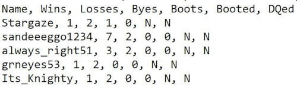
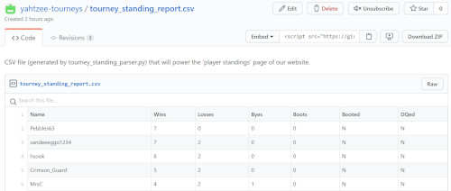

.png)
#                 

### Welcome to the Yahtzee tourney host website!

##### Steps required to update player standings page:

1) Open the Yahtzee report that you exported using your hosting software; an app like Notepad is a solid choice to open the .txt file.

2) Copy (Ctrl + C) the relevant section of the report (shown below).

3) Use [this link](https://gist.github.com/yahtzee-tourneys/418f01e9db9d70bc3cc5786fe15e266d) and click the 'Edit' button (shown below).

4) Paste over the old stadnings and update, as illustrated below

./images/update_gist_screenshot.JPG)

5) **Optional:** Use [this Python script](https://gist.github.com/yahtzee-tourneys/fe71de88ae3bb68963c446a50078a4cc) to pull in your exported tourney standing report and automatically parse and export the relevant report section as a CSV file; use it to complete steps 1-4.
